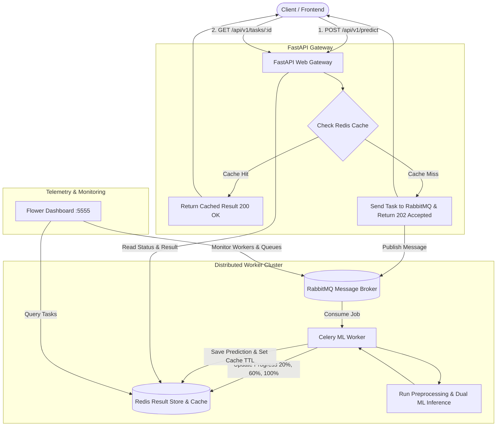

# Distributed Asynchronous ML Inference Platform

[](https://fastapi.tiangolo.com)
[](https://docs.celeryq.dev)
[](https://www.rabbitmq.com)
[](https://redis.io)
[](https://www.docker.com)

A production-grade, distributed asynchronous Machine Learning inference platform built for high-throughput, non-blocking NLP and content risk scoring. Built using **FastAPI**, **Celery**, **RabbitMQ**, **Redis**, and **Flower**.

---

## 🎯 Resume Bullet Points (Copy & Paste Ready)

Add this project to your resume under **Experience** or **Projects**:

* **Distributed Async ML Inference Platform (FastAPI, Celery, RabbitMQ, Redis, Docker)**
  * Architected a distributed asynchronous ML microservice using **FastAPI** and **Celery**, decoupling CPU-bound NLP model inference from the HTTP request loop to achieve **< 10ms API response latency**.
  * Integrated **RabbitMQ** as an AMQP message broker with fair task dispatching (`prefetch_multiplier=1`) and late acknowledgments (`acks_late=True`) to guarantee zero task loss during worker failures.
  * Implemented a dual-purpose **Redis** layer serving as Celery's result backend, real-time task progress tracker (0%–100% granular state transitions), and an **idempotent SHA-256 payload cache** that eliminates redundant inference.
  * Built a dual-pipeline NLP classifier (sentiment + toxicity/phishing risk) on **TF-IDF + Logistic Regression**, replacing naive `predict_proba` thresholds with **decision-margin scoring calibrated against the measured class-separation band**, and layered a deterministic keyword safety net.
  * Hardened failure paths so broker and result-store outages surface as **`503` in seconds** (bounded retry budgets) rather than blocking the HTTP request, with task-level cache re-checks making redelivered messages idempotent.
  * Engineered endpoints for single-item and batch inference (`/api/v1/batch-predict`), structured with **Pydantic v2** validation and standardized error handling.
  * Containerized the platform with **Docker Compose** across 5 coordinated microservices (API, Celery Worker, RabbitMQ, Redis, Flower) with Kubernetes-compatible `/health/live` and `/health/ready` probes.

---

## 🏗️ System Architecture



### Why Both RabbitMQ and Redis?
* **RabbitMQ (Message Broker)**: Industry standard for enterprise message queues. Offers guaranteed message delivery, queue persistence, exchange routing, dead-letter exchanges, and worker load distribution.
* **Redis (Result Store & Cache)**: In-memory key-value database ideal for ephemeral state storage, sub-millisecond polling lookups for task statuses, and key expiration (TTL) for prediction caching.

---

## 🚀 Quick Start with Docker Compose

Ensure Docker and Docker Compose are installed, then run:

```bash
# 1. Clone or navigate to the project directory
cd fastapi-celery-ml

# 2. Build and launch all 5 containers
docker compose up --build
```

Services will be accessible at:
* **FastAPI Interactive Docs**: [http://localhost:8000/docs](http://localhost:8000/docs)
* **RabbitMQ Management UI**: [http://localhost:15672](http://localhost:15672) (User: `guest`, Password: `guest`)
* **Flower Celery Dashboard**: [http://localhost:5555](http://localhost:5555)
* **Readiness Health Probe**: [http://localhost:8000/health/ready](http://localhost:8000/health/ready)

To shut down:
```bash
docker compose down
```

---

## 💻 Local Setup (Without Docker)

If you prefer to run services natively on your machine:

### 1. Prerequisites
* Python 3.10+
* Running Redis instance (`localhost:6379`)
* Running RabbitMQ instance (`localhost:5672`)

### 2. Install Dependencies
```bash
python -m venv .venv
source .venv/bin/activate  # On Windows: .venv\Scripts\activate
pip install -r requirements.txt
```

### 3. Start the Components
Open three separate terminal tabs:

**Terminal 1: Start Celery Worker**
```bash
celery -A app.core.celery_app.celery_app worker --loglevel=info --concurrency=2 -Q ml_inference_queue,ml_batch_queue
```

**Terminal 2: Start Flower Monitoring**
```bash
celery -A app.core.celery_app.celery_app flower --port=5555
```

**Terminal 3: Start FastAPI Application**
```bash
uvicorn app.main:app --host 0.0.0.0 --port 8000 --reload
```

---

## 📡 API Usage & Examples

### 1. Submit Single Text for ML Analysis
```bash
curl -X POST "http://localhost:8000/api/v1/predict" \
     -H "Content-Type: application/json" \
     -d '{"text": "The new release resolved our pipeline bottlenecks! Super smooth experience."}'
```
**Response (`202 Accepted`):**
```json
{
  "task_id": "8a32a67e-450f-48d5-b0b3-e5d83637e1b9",
  "status": "PENDING",
  "message": "Inference job dispatched to RabbitMQ queue. Poll check_status_url for progress.",
  "check_status_url": "http://localhost:8000/api/v1/tasks/8a32a67e-450f-48d5-b0b3-e5d83637e1b9",
  "cached": false,
  "result": null
}
```

### 2. Poll Task Progress & Result
```bash
curl -X GET "http://localhost:8000/api/v1/tasks/8a32a67e-450f-48d5-b0b3-e5d83637e1b9"
```
**While Processing (`PROGRESS`):**
```json
{
  "task_id": "8a32a67e-450f-48d5-b0b3-e5d83637e1b9",
  "status": "PROGRESS",
  "progress": 60,
  "stage": "Executing dual NLP inference pipelines",
  "result": null,
  "error": null
}
```
**When Completed (`SUCCESS`):**
```json
{
  "task_id": "8a32a67e-450f-48d5-b0b3-e5d83637e1b9",
  "status": "SUCCESS",
  "progress": 100,
  "stage": "Completed",
  "result": {
    "input_hash": "40fbbfdf00091adae51650269db191ccefc1e4e68c7db0c3058a32fd53290536",
    "sentiment": {
      "label": "POSITIVE",
      "score": 0.8796,
      "confidence": 0.8986
    },
    "risk": {
      "risk_level": "SAFE",
      "risk_score": 0.0109,
      "flagged_categories": []
    },
    "extracted_keywords": ["release", "resolved", "pipeline", "bottlenecks", "smooth"],
    "word_count": 10,
    "char_count": 75,
    "model_version": "v2.0.0-tfidf-logreg",
    "processing_time_ms": 2.41
  },
  "error": null
}
```

Task states surfaced by this endpoint: `PENDING`, `STARTED`, `PROGRESS`, `RETRY`,
`SUCCESS`, `REVOKED`, and `FAILURE`.

### 3. Idempotent Cache Hit Demonstration
Submit the identical text payload again. FastAPI will immediately detect the SHA-256 hash match in Redis and return in `< 2ms` without invoking RabbitMQ or Celery:
```json
{
  "task_id": "cached-40fbbfdf00091adae",
  "status": "SUCCESS",
  "message": "Result fetched directly from Redis cache (idempotent lookup).",
  "check_status_url": "",
  "cached": true,
  "result": { ... }
}
```

### 4. Submit Batch Inferences
```bash
curl -X POST "http://localhost:8000/api/v1/batch-predict" \
     -H "Content-Type: application/json" \
     -d '{
       "items": [
         {"text": "Exceptional customer support, thank you!"},
         {"text": "URGENT: Click here to verify your bank password immediately!"}
       ]
     }'
```

**Response (`202 Accepted`):**
```json
{
  "batch_id": "b6f1a0c2-7d84-4a19-9f31-2c5e8a0b7d44",
  "total_items": 2,
  "tasks": [
    {
      "task_id": "c1d2e3f4-a5b6-7890-abcd-ef1234567890",
      "status": "PENDING",
      "check_status_url": "http://localhost:8000/api/v1/tasks/c1d2e3f4-a5b6-7890-abcd-ef1234567890"
    }
  ]
}
```

Poll the returned `task_id` to receive the aggregate batch result. Items already
present in the Redis cache are served without re-running inference, and the
response reports how many were reused:
```json
{
  "task_id": "c1d2e3f4-a5b6-7890-abcd-ef1234567890",
  "status": "SUCCESS",
  "progress": 100,
  "stage": "Completed",
  "result": {
    "batch_id": "b6f1a0c2-7d84-4a19-9f31-2c5e8a0b7d44",
    "total_processed": 2,
    "cached_items": 1,
    "results": [ { "...": "one PredictionResult per input item" } ]
  },
  "error": null
}
```

### 5. Cancel a Queued Task
```bash
curl -X DELETE "http://localhost:8000/api/v1/tasks/8a32a67e-450f-48d5-b0b3-e5d83637e1b9"
```

---

## 🧪 Running Automated Tests

Run the test suite with `pytest`:

```bash
pytest -v
```

The suite runs **fully in-process** — no RabbitMQ, Redis or worker is required.
`tests/conftest.py` swaps Celery's result backend for an in-memory store and
drives tasks eagerly, so the full pipeline (dispatch, progress reporting, cache
write, retry backoff) is exercised deterministically.

Tests validate:
* Schema validation and 422 error boundaries (including whitespace-only input)
* Idempotent Redis cache lookups (hits vs. misses) and worker-side cache reuse
* Celery task scheduling, granular progress transitions, and exponential retry
  backoff up to the permanent-failure ceiling
* Dual ML pipeline classification (Sentiment + Risk/Toxicity), including
  **held-out phrasings that are absent from the training corpus** to prove the
  model generalises rather than memorises
* Graceful degradation: broker/result-store outages return `503`, never `500`
* Infrastructure guarantees asserted from config (`prefetch_multiplier=1`,
  `acks_late`, queue routing, fail-fast retry budgets)

---

## 📂 Project Structure

```text
fastapi-celery-ml/
├── docker-compose.yml          # 5-service orchestration (API, Worker, RMQ, Redis, Flower)
├── Dockerfile                  # Slim production Docker image
├── .dockerignore               # Keeps the build context small and reproducible
├── pytest.ini                  # Test discovery + in-process Celery harness config
├── requirements.txt            # Python dependencies
├── .env.example                # Config template
├── README.md                   # Full documentation & resume guide
├── app/
│   ├── main.py                 # FastAPI app factory, CORS, lifespan
│   ├── config.py               # Pydantic BaseSettings environment manager
│   ├── api/
│   │   ├── routes.py           # /predict, /batch-predict, /tasks/{task_id}
│   │   └── health.py           # /health/live, /health/ready probes
│   ├── core/
│   │   ├── celery_app.py       # Celery configuration with RabbitMQ & Redis
│   │   ├── cache.py            # Redis cache manager & SHA-256 key hashing
│   │   └── logger.py           # Structured logger
│   ├── models/
│   │   ├── schemas.py          # Pydantic v2 schemas
│   │   └── ml_model.py         # Dual NLP ML inference engine
│   └── workers/
│       └── tasks.py            # Async Celery tasks with progress reporting & retries
└── tests/
    ├── conftest.py             # In-memory Celery harness & shared fixtures
    ├── test_api.py             # FastAPI API integration tests
    ├── test_tasks.py           # ML inference, caching & retry unit tests
    └── test_infrastructure.py  # Config guarantees & health-check tests
```

---

## 🧠 ML Model Notes

The dual pipelines are TF-IDF + Logistic Regression classifiers trained on a
curated in-repo corpus (`MLRiskIntelligenceModel._get_training_corpus`).

Two details matter for correctness and are worth calling out:

1. **Class balance.** The corpus is deliberately balanced across `POSITIVE` /
   `NEUTRAL` / `NEGATIVE` and across the risk classes. An imbalanced corpus
   makes a linear classifier collapse onto the majority-class prior, which
   silently destroys classification accuracy.

2. **Margin-based scoring, not `predict_proba`.** L2-regularised Logistic
   Regression squashes `predict_proba` toward the prior, so absolute probability
   thresholds are meaningless. The pipelines therefore score on the signed
   `decision_function` margin, and the risk tiers are calibrated against the
   **empty band between the two classes measured on the training set**. The
   derived `risk_center` / `risk_scale` values are persisted alongside the
   model and restored on load.

Risk classification combines the statistical model with a deterministic keyword
safety net (`RISK_KEYWORDS`). Keyword hits act as a *floor* — each flagged
category escalates the tier by one step — so an explicit phishing or threat
signal can never be silently ignored by the model.

Model artifacts are gitignored (`*.joblib`) and rebuilt on first start. The
artifact stores its `model_version`; bumping `MODEL_VERSION` invalidates stale
artifacts and forces a retrain.

---

## 🛡️ Production & Scalability Best Practices

1. **Horizontal Worker Scaling**: Scale worker instances independently based on queue latency:
   ```bash
   docker compose up --scale worker=4
   ```
2. **Fair Task Dispatching**: Configured `worker_prefetch_multiplier = 1` so workers do not greedily prefetch tasks that could be handled by idle workers.
3. **Task Durability**: RabbitMQ durable queues combined with `task_acks_late = True` ensures tasks are only acknowledged once successfully processed and saved.
4. **Graceful Fault Tolerance**: Celery tasks implement exponential retry backoff on unexpected runtime errors.
5. **Fail-Fast Infrastructure Handling**: Broker and result-store retry budgets are bounded (`broker_transport_options`, `result_backend_transport_options`) so a dependency outage returns `503` in seconds instead of holding the HTTP request open inside Celery's default retry loops. Cache reads/writes degrade to a miss rather than failing the request.
6. **Task-Level Idempotency**: Workers re-check the Redis cache before running inference, so a redelivered message (possible under `acks_late`) never duplicates work.
